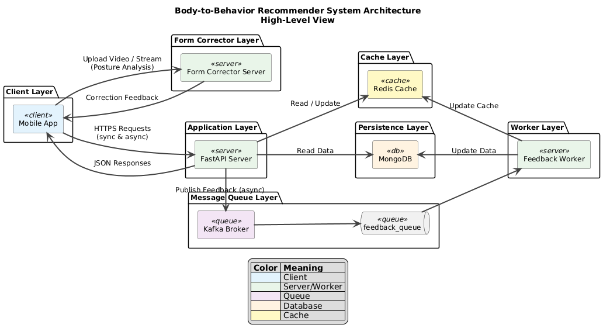
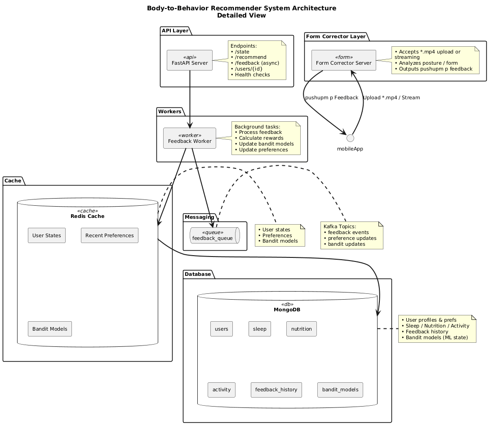

<div align="center">
  <h1>🧠 Body→Behavior Recommender</h1>
  <p><strong>Hackathon Project – FastAPI + MongoDB + Docker</strong></p>
  
  
  
  
  <h2 style="margin: 8px 0 0;">Team 2 cham3at</h2>
  <p><strong>Members:</strong> Salma Bouabidi • Younes Makhlouf • Khelil Mehdi • Mahdi chaabane</p>
</div>

---

## 🎥 Demo Video

[Watch the demo (Google Drive)](https://drive.google.com/drive/u/0/folders/1ktH9sNaFTbd5ufky4jjQHtsg8B3Qp7Ie)

---

## 🚀 How to Run the App (Docker)

Run everything with a single command:

```bash
docker compose up --build
```

Once started, access the services here:

- Frontend (FitMix UI): http://localhost:3000
- API (FastAPI): http://localhost:8000 (health: http://localhost:8000/health)
- Form Corrector (FastAPI + OpenCV): http://localhost:9000 (health: http://localhost:9000/health)
- MongoDB: localhost:27017 (inside Compose network: `mongo:27017`)

Notes
- The frontend proxies requests to the form-corrector via `/form-corrector/*` (handled by Nginx in the frontend container).
- First build can take a few minutes (MediaPipe/OpenCV). Subsequent starts are much faster.

---

## 🚀 Overview

**Body→Behavior Recommender** is an adaptive health assistant that transforms daily health signals (sleep, nutrition, activity) into actionable, personalized suggestions—music tracks, meals/snacks, and micro-workouts. Built with **FastAPI + MongoDB + Docker**, it ingests large datasets into a persistent database and delivers intelligent recommendations using bandit learning algorithms.

---

## 📈 Scalability

This stack is designed for straightforward scale-up and scale-out:

- API (FastAPI)
  - Stateless services → scale horizontally behind a load balancer.
  - Connection pooling to MongoDB; indexes for hot queries (user_id + time keys).
  - Heavy computations run at startup or in background tasks, keeping per-request latency low.

- MongoDB
  - Indexing strategy focused on user_id + timestamps; aggregation pipelines for efficient summaries.
  - Can upgrade to a managed Atlas cluster with replica sets and sharding as data grows.

- Frontend
  - Built assets are static and CDN-friendly; can be served by any edge/CDN.
  - Nginx reverse-proxy routes `/form-corrector` to the internal service in Compose/Cluster.

- Form Corrector (Computer Vision)
  - CPU-first OpenCV/MediaPipe; isolate as a dedicated microservice.
  - Scale replicas based on request rate; optional GPU-accelerated path for heavier models.

- From Compose to Kubernetes
  - One-to-one mapping of services → Deployments/Services.
  - Add Ingress for public routing, HPA for autoscaling, persistent volumes for MongoDB.

---

## 🏆 Why It Stands Out

### 🎯 **Innovation & Intelligence**

- **Multi-Domain Adaptation:** Recommends across music, nutrition, and activity based on real-time health state
- **Bandit Learning:** Uses Thompson Sampling + kNN context for evolving, personalized choices
- **Real-Time State Computation:** Instantly computes Readiness, Fuel, and Strain from user data

### 🚀 **Scalability & Performance**

- **MongoDB Backend:** Persistent storage with optimized indexing for large datasets
- **Docker Deployment:** Containerized for consistent deployment across environments
- **Efficient Data Handling:** Bulk ingestion with proper indexing strategies
- **Fast Startup:** < 10 seconds with database caching

### 📊 **Data Scale**

- **Users:** 50,000+
- **Sleep Records:** 500,000+
- **Activities:** 1,000,000+
- **Measurements:** 100,000+
- **Heart Rate Data:** 3GB+ optimized streaming ingestion

---

## 🏗️ Architecture



#### Detailed architecture



### **Core Components:**

- **Entry Point:** `main.py` + `src/body_behavior_recommender/app.py`
- **Database Layer:** `mongo_wrapper.py` + `db.py` for connection management
- **Data Ingestion:** `data_loader.py` with bulk MongoDB operations
- **Domain Models:** Pydantic v2 models for type safety and validation
- **Business Logic:** `services.py` with state computation and bandit algorithms
- **API Layer:** RESTful endpoints with comprehensive health and recommendation APIs

---

## 🔄 Core Recommendation Loop

```
📊 SENSE → 🧠 DECIDE → ⚡ ACT → 📈 LEARN
```

1. **📊 SENSE:** Compute user state (Readiness, Fuel, Strain) from recent MongoDB data
2. **🧠 DECIDE:** Select optimal domain (meal/workout/music) based on current state
3. **⚡ ACT:** Generate, filter, and rank candidates; apply bandit sampling
4. **📈 LEARN:** Process feedback to update bandit models and user preferences

---

## 🧠 Intelligent Recommendation Logic

### **State Computation:**

- **🛌 Readiness:** Sleep quality + bedtime consistency + recovery metrics
- **🍎 Fuel:** Protein/fiber adequacy - sugar/sodium penalties
- **💪 Strain:** Steps z-score + heart rate + active minutes

### **Ranking Algorithm:**

```
Score = 0.35×GoalFit + 0.30×StateFit + 0.25×PrefFit + 0.10×Novelty - Penalties
```

### **Bandit Learning:**

- **Algorithm:** Thompson Sampling with kNN context
- **Context:** Normalized state vectors per (user_id, domain)
- **Adaptation:** Real-time learning from user feedback

---

## 🛠️ API Endpoints

| Method | Endpoint           | Description                                    |
| ------ | ------------------ | ---------------------------------------------- |
| `GET`  | `/health`          | User health summary and metrics                |
| `GET`  | `/state`           | Current computed state (Readiness/Fuel/Strain) |
| `POST` | `/recommend`       | Get personalized recommendation                |
| `POST` | `/feedback`        | Submit feedback for learning                   |
| `GET`  | `/users/{user_id}` | User profile and preferences                   |
| `GET`  | `/stats`           | System statistics and data insights            |

---

## 🐳 Quick Start with Docker

### **Production Deployment:**

```bash
# Clone and start the entire stack
git clone https://github.com/YounesMakhlouf/seneca-hacks-2025.git
cd seneca-hacks-2025
docker-compose up --build

# API available at http://localhost:8000
# MongoDB at localhost:27017
```

### **Local Development:**

```bash
# Start MongoDB only
docker-compose up mongodb

# Run FastAPI locally
uv run uvicorn main:app --reload
```

---

## 📊 Database Schema & Performance

### **MongoDB Collections:**

- **Users:** Indexed by `user_id`, demographics, and preferences
- **Sleep:** Indexed by `user_id` + `date` for time-series queries
- **Activities:** Indexed by `user_id` + `timestamp` with activity type
- **Measurements:** Indexed by `user_id` + `date` for body metrics

### **Performance Optimizations:**

- **Compound Indexes:** Multi-field indexes for complex queries
- **Aggregation Pipelines:** Efficient data processing and statistics
- **Connection Pooling:** Optimized MongoDB connection management
- **Bulk Operations:** Efficient data ingestion and updates

---

## 🧪 Testing & Validation

```bash
# Run comprehensive tests
uv run pytest tests/

# Test API endpoints
curl http://localhost:8000/health
curl -X POST http://localhost:8000/recommend \
  -H "Content-Type: application/json" \
  -d '{"user_id": "user_123"}'
```

---

## 🚀 Future Extensibility

### **Ready-to-Implement Features:**

- **📱 Real-time Heart Rate:** Streaming ingestion pipeline
- **🌤️ Weather Integration:** Environmental context for recommendations
- **🛒 Grocery Planning:** Meal recommendation with shopping lists
- **👥 Social Features:** Group challenges and shared recommendations
- **🎯 Advanced Analytics:** ML-powered health insights and trends

---

## 🏆 Team Achievements

- **⚡ Rapid Development:** Full-stack implementation in hackathon timeframe
- **📊 Data Scale:** Successfully handling millions of health records
- **🧠 AI Integration:** Advanced bandit learning for personalization
- **🐳 Production Ready:** Docker deployment with MongoDB persistence

---

## 📚 Technology Stack

- **🐍 Backend:** FastAPI + Pydantic v2
- **🗄️ Database:** MongoDB with optimized indexing
- **🐳 Deployment:** Docker + Docker Compose
- **📦 Package Management:** UV for fast Python dependency management
- **🧠 ML:** MABWiser for bandit algorithms
- **🔧 Development:** Type hints, async/await, comprehensive error handling

---

<div align="center">
  <h3>🎯 Ready to transform health signals into intelligent action!</h3>
  <p><em>Built for scalability, designed for intelligence, optimized for impact.</em></p>
</div>
